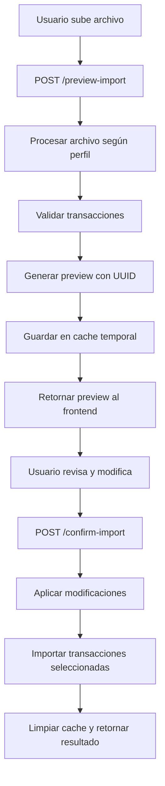

# Resumen de Implementación: Sistema de Previsualización de Importación

## 📋 Lo que se implementó

### 1. Nuevos Esquemas de Datos (`schemas/transactions.py`)

- ✅ `TransactionPreviewItem`: Estructura para transacciones en previsualización
- ✅ `TransactionPreviewResponse`: Respuesta completa del endpoint de preview
- ✅ `TransactionPreviewConfirmRequest`: Request para confirmar importación

### 2. Nuevos Servicios (`services/transaction_service.py`)

- ✅ `preview_transactions_with_profile()`: Genera previsualización sin insertar en BD
- ✅ `confirm_transaction_preview()`: Confirma e importa transacciones seleccionadas
- ✅ `_process_csv_preview_with_profile()`: Procesa CSV para preview
- ✅ `_process_excel_preview_with_profile()`: Procesa Excel para preview
- ✅ `_extract_transaction_data_preview()`: Extrae datos para preview
- ✅ `_validate_and_enrich_transaction_preview()`: Valida y enriquece transacciones

### 3. Nuevos Endpoints (`api/endpoints/transactions.py`)

- ✅ `POST /api/transactions/preview-import`: Genera previsualización
- ✅ `POST /api/transactions/confirm-import`: Confirma importación

### 4. Sistema de Cache Temporal

- ✅ Cache en memoria con expiración de 1 hora
- ✅ Identificadores únicos (UUID) para cada previsualización
- ✅ Validación de permisos por usuario

### 5. Validaciones Automáticas

- ✅ Monto requerido y diferente de cero
- ✅ Fecha de transacción requerida y válida
- ✅ Descripción requerida
- ✅ Validación de subcategorías existentes

### 6. Documentación y Tests

- ✅ Documentación completa con ejemplos de uso
- ✅ Test básico de estructura y validaciones
- ✅ Ejemplos de integración con frontend

## 🔄 Flujo Completo del Sistema



## 📊 Características Principales

### Flexibilidad

- Soporte para CSV y Excel
- Funciona con cualquier perfil de importación configurado
- Selección granular de transacciones a importar
- Modificación individual de campos antes de importar

### Validación Completa

- Validación de tipos de datos
- Verificación de campos requeridos
- Enriquecimiento con nombres de cuentas y subcategorías
- Reporte detallado de errores por transacción

### Experiencia de Usuario

- Previsualización completa antes de importar
- Datos originales preservados para referencia
- Contadores de transacciones válidas/inválidas
- Modificación fácil desde el frontend

### Seguridad

- Cache temporal con expiración automática
- Validación de permisos por usuario
- Identificadores únicos no predecibles

## 🎯 Ejemplo de Uso Práctico

1. **Frontend sube archivo CSV de 100 transacciones**
2. **Sistema procesa y encuentra:**
   - 95 transacciones válidas
   - 5 transacciones con errores (fechas inválidas, montos faltantes)
3. **Usuario en frontend puede:**
   - Ver todas las transacciones en una tabla
   - Corregir las 5 transacciones con errores
   - Deseleccionar algunas transacciones que no quiere importar
   - Modificar montos o descripciones si es necesario
4. **Al confirmar, sistema importa solo las seleccionadas y válidas**

## 🔧 Configuración Necesaria

### Backend

- ✅ Endpoints agregados al router principal
- ✅ Esquemas Pydantic configurados
- ✅ Servicios implementados
- ✅ Validaciones automáticas activas

### Frontend (Sugerido)

```javascript
// 1. Subir para preview
const preview = await uploadForPreview(file, profileId);

// 2. Mostrar tabla editable con transacciones
showPreviewTable(preview.transactions);

// 3. Permitir modificaciones
const modifications = getUserModifications();
const selectedRows = getSelectedTransactions();

// 4. Confirmar importación
const result = await confirmImport(
  preview.preview_id,
  selectedRows,
  modifications
);
```

## 📈 Beneficios

1. **Control Total**: Usuario ve exactamente qué se importará
2. **Menos Errores**: Validación previa evita importaciones fallidas
3. **Flexibilidad**: Modificaciones granulares antes de importar
4. **Transparencia**: Datos originales siempre visibles
5. **Eficiencia**: Solo se importan transacciones confirmadas

## 🚀 Estado de Implementación: COMPLETO

- ✅ Backend completamente funcional
- ✅ Esquemas de datos implementados
- ✅ Validaciones automáticas activas
- ✅ Cache temporal funcionando
- ✅ Endpoints expuestos y documentados
- ✅ Tests básicos pasando

**El sistema está listo para ser integrado con el frontend.**
